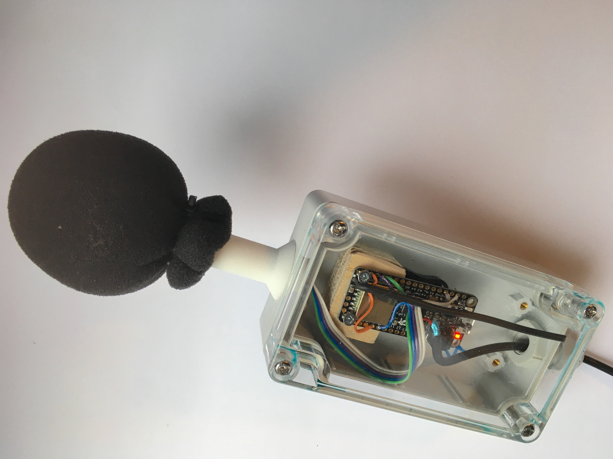
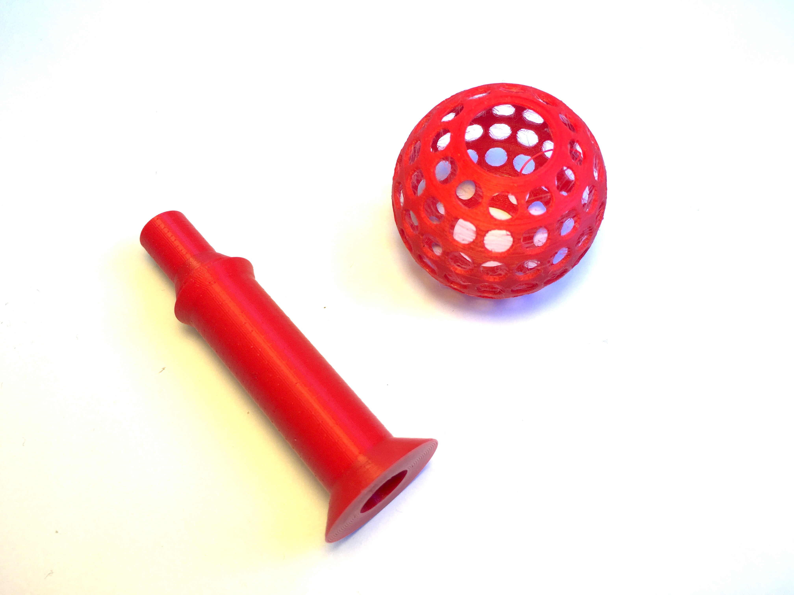
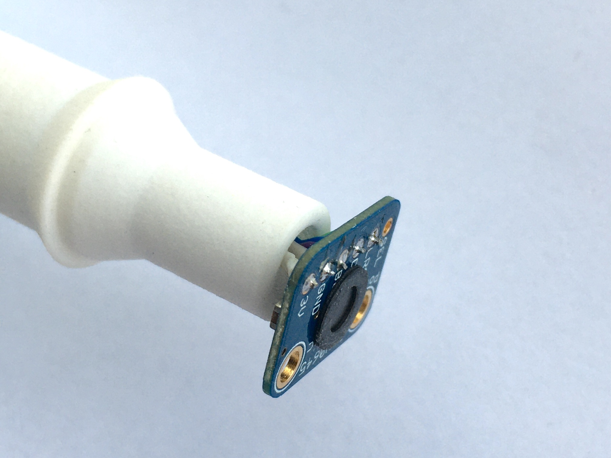

* [Amsterdam Sounds kit](#amsterdam-sounds-kit)
* [Electronic components assembly](#electronic-components-assembly)
* [Code installation](#code-installation)
* [Configuration](#configuration)
* [TTN setup](#ttn-setup)
* [Tools](#tools)
* [Enclosure](#enclosure)
* [Code documentation](#code-documentation)
* [Limitations / known issues](#limitations--known-issues)
* [Considerations](#considerations)
* [Parts list](#parts-list)
* [References](#references)

## Amsterdam Sounds kit  
**Open source (hardware) sound level meter for the internet of things.**



However the code is intended for bringing a TTN sound level meter in the air. The code can easily be adapted to make a stand alone offline device by stripping out the LoRa part of de the code.

## Electronic components assembly

* SPH0645LM4H-B on breakout board (Adafruit)
* Adafruit Feather M0 RFM95 LoRa

The least that needs to be done to get the sound level measurement part running is connecting the microphone (SPH0645LM4H) to the microcontroller. The schematic diagram assumes a Adafruit Feather M0 RFM95 LoRa is used. With other pins a Arduino Zero will also work and any other ATSAMD21 Cortex M0 based board.

```
+---------+     +----------------+  
| SPH0645 |     | Feather M0     |  
+---------+     +----------------+  
| 3V      | <-> | 3V             |
| GND     | <-> | GND            |
| BCLK    | <-> | 1 / I2SCK / TX |
| DOUT    | <-> | 9 / I2SD0      |
| LRCL    | <-> | 0 / I2SF0 / RX |
| SEL     |     |                |
+---------+     | IO1            | <-+
                |                |   |
                | 6              | <-+
                | Ant.           | <------------------------
                +----------------+
```

**N.B.**
* For getting the LoRa communication running make sure to also connect pin 6 and I01 since this is used by LMIC library to control the radio module.
* A solid wire can be use as an antenna. [Look up](https://learn.adafruit.com/adafruit-feather-m0-radio-with-lora-radio-module/antenna-options) which length is needed for which LoRa frequency.

## Code installation

#### Adafruit SAMD boards

* Add the following URL to **Additional Boards manager URLs** in the Arduino IDE Preferences in order to be able to install the firmware for the Feather M0.  
https://adafruit.github.io/arduino-board-index/package_adafruit_index.json
* Install **Adafruit SAMD boards** using the **Boards manager** in the Arduino IDE. Version 1.4.1 was used for this project.

#### MCCI LoRaWAN LMIC library

* Install the **MCCI LoRaWAN LMIC library** using the **Library manager** in the Arduino IDE. Version 2.3.2 was used for this project.

#### AmsterdamSoundsKit

* Download the code and open [**AmsterdamSoundsKit.ino**]([Arduino/AmsterdamSoundsKit/AmsterdamSoundsKit.ino]) in the  Arduino IDE.

## Configuration

#### General settings

* *SEND_AFTER*  
Defines at which rate the device sends updates to The Things Network. Keep in mind that there is a limited data rate for the TTN (see [maximum duty cycle](https://www.thethingsnetwork.org/docs/lorawan/duty-cycle.html#maximum-duty-cycle)). The devices sends a summary over the specified period (see [limitations](#limitations--known-issues)).
* *DISABLE_SERIAL*  
Setting this to 1 disables all serial communication. This is recommended to do when deploying the device to stand-alone.

Snippet from [*AmsterdamSoundsKit.ino*](Arduino/AmsterdamSoundsKit/AmsterdamSoundsKit.ino)

```c
// Disable all serial ouput, use when device is deployed somewhere
#define DISABLE_SERIAL    1

// Send to TTN after each N seconds of measuring
#define SEND_AFTER    300
```

#### LoRa settings

Currently only ABP is implemented. The device address and keys have to be set to the ones generated in the TTN console.

Snippet from [*LoraSettings.h*](Arduino/AmsterdamSoundsKit/LoraSettings.h)

```c
static const PROGMEM u1_t NWKSKEY[16] = {0x00, 0x00, 0x00, 0x00, 0x00, 0x00, 0x00, 0x00, 0x00, 0x00, 0x00, 0x00, 0x00, 0x00, 0x00, 0x00 };
static const u1_t PROGMEM APPSKEY[16] = {0x00, 0x00, 0x00, 0x00, 0x00, 0x00, 0x00, 0x00, 0x00, 0x00, 0x00, 0x00, 0x00, 0x00, 0x00, 0x00 };
static const u4_t DEVADDR = 0x00000000;
```

* *NWKSKEY*  
16 byte **Network Session Key** to be copied from device overview in TTN console.

* *APPSKEY*  
16 byte **App Session Key** to be copied from device overview in TTN console.

* *DEVADDR*  
4 byte **Device Address** to be copied from device overview in TTN console.

#### SLM settings

Snippet from [*SLMSettings.h*](Arduino/AmsterdamSoundsKit/SLMSettings.h)

```c
// Current mode
#define SLM_MODE SLM_MODE_DEBUG
```

* *SLM_MODE*  
Defines if and how the device outputs to the serial port, allowed values:
 * *SLM_MODE_NORMAL*  
 The SLM part of the code does not output at all. Use when deploying the device to stand-alone situation.
 * *SLM_MODE_STREAM_AUDIO*  
 The SLM streams the raw audio data from the microphone to serial port converting the 18 bit samples to 32 bit. This allows for capturing the audio to disk or listening to it to make sure it is OK (see [Tools](#tools)).
 * *SLM_MODE_STREAM_FFT*  
 The SLM outputs the raw ouput of the FFT to the serial port. Can be used in combination with the [*SpectrumPlotter*](Arduino/AmsterdamSoundsKit/Tools/SpectrumPlotter/SpectrumPlotter.pde) Processing tool. Note, conversion from fixed point numbers to float is done in Processing.
 * *SLM_MODE_OUTPUT*  
 The SLM outputs live dBA levels in a binary format. Intended to use with [*SPLDisplay*]((Arduino/AmsterdamSoundsKit/Tools/SpectrumPlotter/SPLDisplay.pde) Processing tool.
 * *SLM_MODE_DEBUG*  
 The SLM writes live dBA levels in readable format to the serial port.
 * *SLM_MODE_PROFILE*  
 The SLM outputs the amount of time it consumes for doing the audio analysis.


* *Other settings*  
These settings are probably good to go. They allow you to tweak how the audio is analysed. Current settings make the device capture audio at 48000Hz and do a FFT analysis over 1024 samples of audio at a rate of 32 times per second. Changing these settings could lead to performance or memory issues. For example, longer FFT requires more processing time and longer buffers. Secondly the  scaling table for correcting the frequency response of the microphone and doing dBA weighting is precalculated for a specific FFT size. Changing this would require precalculating a new table ([*EQ.h*](Arduino/AmsterdamSoundsKit/)).

#### LMIC library settings  

Make sure to set the correct LoRa network plan in *lmic_project_config.h*. This file typically resides in the *libraries/MCCI_LoRaWAN_LMIC_library/project_config* folder in your Arduino projects folder.  
The following settings are an example for use of the European TTN plan.

```c
#define CFG_eu868
#define LMIC_DEBUG_LEVEL 0
#define CFG_sx1276_radio 1
#define ARDUINO_SAMD_FEATHER_M0
#define DISABLE_BEACONS
#define DISABLE_PING
#define DISABLE_JOIN
```

## TTN setup

In order to be able to send data to The Things Network you have to make an account, [register](https://www.thethingsnetwork.org/docs/applications/add.html) an *application* and [add](https://www.thethingsnetwork.org/docs/devices/registration.html) *devices* to that application.
The application is your sandbox within TTN that manages all the devices registered to the application. N.B. currently the Arduino code only supports ABP devices, no OTAA yet.

#### Application setings

Apart from having to register individual devices nothing much has to be done here, except for setting the payload format. The sensor sends each frame of data in particular format to save bandwidth. The format at the sending end has to match the format at the receiving end.

**Payload format**

The following code decodes the bytes received from the sensor. It mainly converts fixed point numbers to floating point numbers.  
**The following code must be pasted** in the *decoder* tab of your application its payload formats. The other tabs (*converter*, *validator* and *encoder*) can be left empty.

```js
// For example, an uQ7.1 is an unsigned number with 7 bits for the integer part and 1 bit for the fractional part.
// As such it has a range of [0 - 127.5].
function Decoder(bytes, port) {
  var mean = bytes[0]/2.0; //convert from uQ7.1
  var min = bytes[1]/2.0; //convert from uQ7.1
  var max = bytes[2]/2.0; //convert from uQ7.1
  var stddev = bytes[3]/8.0; //convert from uQ5.3
  var n = (bytes[5] << 8) | bytes[4];
  return {
    mean: mean,
    min: min,
    max: max,
    stddev: stddev,
    n: n
  };
}
```

#### Device settings

For each device added to the application the following settings have to be applied in the settings tab of the device:

* *Activation Method* : ABP  
 ABP is currently used since this has less overhead than OTAA which is preferable wnen the devices resets often (as the device does, see [limitations](#limitations--known-issues) ).

* *Frame Counter Checks* : Off  
 These need to be disabled. This is a security flaw, but the microcontroller can only use its flash as persistent memory, so keeping frame counts on the device is not ideal.

## Tools

The following tools can be found in the repository:

* [*precalculate_bin_scale_table*](Arduino/AmsterdamSoundsKit/Tools/PrecalculateBinScaleTable/precalculate_bin_scale_table.rb)  
A Ruby script that generates the table in [*EQ.h*](Arduino/AmsterdamSoundsKit/). It uses the frequency response of the microphone as input and a formula for calculating the frequency response of the dBA weighting. The microphone response was extracted from the datasheet.
* [*SPLDisplay*](Arduino/AmsterdamSoundsKit/Tools/SPLDisplay/SPLDisplay.pde)  
A Processing sketch that reads data from the sensor in order to display it nicely. ([SLM settings](#slm-settings)).
* [*SpectrumPlotter*](Arduino/AmsterdamSoundsKit/Tools/SPLDisplay/SPLDisplay.pde)  
A Processing sketch that reads raw FFT output data from the sensor in order to display it ([SLM settings](#slm-settings)).
* Capturing / listening device audio using unix/linux tools  
```bash
# capture audio to disk
cat /dev/cu.usbmodem14111 > audio.raw
# listen to audio (install mplayer command line utility)
cat /dev/cu.usbmodem14111 | mplayer -rawaudio rate=48000:channels=1:samplesize=4 -demuxer rawaudio -cache 1024 -
```
Put the device in [SLM_MODE_STREAM_AUDIO](#slm-settings).

## Enclosure

The bare components can be put in a custom housing for outdoor use.
Within the Amsterdam Sounds project a standard sized box (115mm x 65mm x 40mm) is used for containing the microprocessor and the antenna. The microphone placement is a little more difficult. It must be outside, but protected from the weather.

#### 3D printable microphone mount  
A custom 3D printable mount was designed for placing the microphone outside of the box and as a base for a standard sizes microphone windshield. The mount consists of [*two parts*](Arduino/AmsterdamSoundsKit/Enclosure) that can be printed with a 3D printer or ordered via an online printing service.



The mount can be glued onto the standard casing (PVC glue does work, drill a whole for the microphone cable first).

#### Acoustic vent  
In order to protect the microphone sound input hole an acoustic vent was used. These vents have a acoustically transparent ePTFE membrane and are used by smartphone manufacturers for the protection of microphones and speakers.
Sadly this is the one part that is not easily available if you just want to buy little amounts. However, they can be ordered via Alibaba for example. The vent is an adhesive that can be applied like a sticker directly on the SPH0645 breakout board.



#### Other parts

* A cable gland was used to lead the power cable into the box.
* A GoPro adapter was screwed into enclosure to make it compatible with GoPro mounting gear.

See complete [parts list](#parts-list)

## Code documentation

Code documentation is mainly written in the comments of the code.

## Limitations / known issues

#### Timing  
LoRa timing is critical. Currently the SLM cannot read en process audio and do the LoRa communication at the same time.

#### Data rate
LoRa has limited bandwidth for data transfer. Therefore the sensor only sends averages and statistics over periods of time (default minutely).

## Considerations

#### LoRaWAN

LoRaWAN was chosen as the network technology for this project since a lot of devices will be deployed in an area that is to big for WiFi coverage, but small enough for one TTN gateway. As such devices are only dependent of power when deployed.

#### Using FFT  
Using an FFT in the process of calculating dBA may seem inefficient. A time domain filter can also be used to do the A-weighting and microphone frequency response correction. However the CMSIS-DSP FFT implementation is quick enough. Also it saves us from having to use (or make) an extra filter designer tool. Besides scaling the FFT bins is an insightful way of correcting the frequency response.
Additionally, the DC-offset of microphone is quite big. Ignoring the first bin easily removes the whole effect that this would have on the sound level.
Finally a future version of this device might also send spectral information.

#### Statistics
Ideally the devices would send everything that it calculates. That would be about 32 dBA levels per second. At least with LoRa this is not doable. Therefore the device should send data at a much lower rate, at most once every minute. As such the device sends a summaries of measuring periods. Currently the summary contains the following statistical data.

* **min**  
The lowest LEQ recorded over the measuring period
* **mean**  
The mean LEQ over the measuring period
* **max**  
The highest LEQ recorded over the measuring period
* **stdev**  
The standard deviation over the mean LEQ.
* **N**  
The amount of frames analysed  over the measuring period.

*The standard deviation gives some insight in regularity of the sound level over the measuring period. Since the device sends only summaries a lot of spikes will be lost, however a high standard deviation is a hint for a period with a lot of variation in sound level.*

*LEQ being the running average dBA level over 1/8th of a second. Typically calculated over 8 analysed frames.*

#### Spectral information

Sound levels in dBA tell something about the noise situation, but not everything. The perception of two sounds with the same level can be totally different. One peak can be much more pervasive during a moment of silence. The Amsterdam Sounds project is about mapping the noise situation in the city of Amsterdam. It would give a lot of insight if we could not only measure the levels of sound but also define what the sound is and how it was experienced by people.
A first step to increasing the possibilities for increasing such insights might be to send spectral information from the device. It comes in handy that the device already does FFT analysis.

## Parts list

1. Microphone on breakout board  
https://www.adafruit.com/product/3421
1. Feather M0 with integrated LoRa radio for European frequency plan (EU863-870)  
https://www.adafruit.com/product/3178
1. Li Yue ⌀7x4mm, acoustic vent for sealing the microphone hole  
https://www.alibaba.com/product-detail/Black-Custom-Size-Waterproof-IP-67_62167248114.html
1. RND 455-00182, standard size enclosure (115mm x 65mm x 40mm)   
https://www.reichelt.nl/kunststof-behuizing-115-x-65-x-40-lichtgrijs-rnd-455-00182-p193396.html
1. Rycote 35/50 Reporter Mic Foam  
https://rycote.com/microphone-windshield-shock-mount/mic-foams-and-windjammers/
1. GoPro mount adapter  
https://www.uwcamera.nl/webshop/actioncam-accessoires/bekijk-alle-accessoires/detail/9647/14-male-schroefdraad-naar-gopro-adapter--tripod-adapter-omvormer.html

*Manufacturers website links where possible.*

## References

1. Project homepage  
https://amsterdamsounds.waag.org
1. Design of a Sound Level Meter, Douglas Lanman  
https://alumni.media.mit.edu/~dlanman/courses/decibel_meter.pdf  
1. CMSIS-DSP library reference  
https://arm-software.github.io/CMSIS_5/DSP/html/modules.html
1. Arduino IBM LMIC (LoRaWAN-MAC-in-C) library  
https://github.com/mcci-catena/arduino-lmic
1. Datasheet of digital MEMS microphone (SPH0645LM4H)  
https://cdn-shop.adafruit.com/product-files/3421/i2S+Datasheet.PDF
